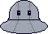
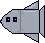
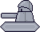

# Metal Mansion

## Overview
A run-and-gun platformer game inspired by classic games like Mega Man!

## Gameplay
- **Move Left:** Press &larr; or A
- **Move Right:** Press &rarr; or D
- **Jump:** Press Spacebar
- **Shoot:** Press E, F or Click the left mouse button

## Story
Following the arrest of an illegal weapons manufacturer, Kaori and Ren, two super-powered vigilantes, have discovered his secret lair of killer robots. Guide them through the mansion to destroy his evil designs before they fall into the wrong hands...

## Characters
###  Kaori
A young woman proficient with multiple types of firearms. A keen vigilante with strong moral values who always tries to do right by her loved ones while satiating her love for combat.

Kaori overwhelms her enemies through sheer force: destroying them with powerful bullets at a rapid pace, however, her own defences are lacking.

If she collects the energy pills in her level, she can shoot multiple bullets in the boss room, destroying the strongest enemies with speed and precision.

###  Ren
A young man who's fairly disinterested in putting his life on the line to stop killer robots, but equally doesn't want to leave his girlfriend to handle them alone. He seems a little moody, but his heart's in the right place!

Ren takes things fairly slow, toasting his enemies with somewhat weak fireballs. His defences, however, are top-notch, allowing him to take many hits with ease.

If he collects the energy pills in his level, he will briefly become invincible, giving him a window to dismantle his foes' defences at no risk to himself.

## Levels
### Kaori Level
Navigate down through the mansion, taking care to avoid traps. If you can't progress, make sure to destroy every enemy in sight!

### Ren Level
Navigate up through the cold, lower levels of the mansion. Besides killer robots, there is slippery, painful ice you must melt with his magic!

### Boss Level
The final standoff: take down a giant UFO who's dispatching countless minions to try and stop you! If you've collected energy pills, this is much easier.

## Enemies
###  UFO
A simple enemy which, when approached, will pursue the player horizontally. Despite all appearances, they actually can't fly!

###  Missile
A cruel enemy which will relentlessly pursue the player for as long as it lives... Can fly anywhere on screen!

###  Tank
A powerful, yet unintelligent enemy which moves horizontally from wall-to-wall while shooting at the player.

###  Cannon
Harmless... Until it shoots out a UFO, Missile or Tank!

## Power-Ups
###  Energy Pill
Collect these throughout the stage to make the final boss easier! One pill results in one second of powered-up play.

## Credits
- akshaydabest_777 (2023) oof sound effect. Pixabay [download] [Accessed 23 April 2024].
- chrissonnenberg90 (2024) Digital Dreamscape. Pixabay [download] [Accessed 23 April 2024].
- CraftPix (2021) Free Industrial Zone Tileset Pixel Art. Available from: https://craftpix.net/freebies/free-industrial-zone-tileset-pixel-art/ [Accessed 23 April 2024].
- floraphonic (2023) Fireball Whoosh 1. Pixabay [download] [Accessed 23 April 2024].
- floraphonic (2024) You Win Sequence 2. Pixabay [download] [Accessed 23 April 2024].
- keytri (2023) To The Death. Pixabay [download] [Accessed 23 April 2024].
- moodmode (2023) 8-bit Game. Pixabay [download] [Accessed 23 April 2024].
- Pixabay (2021) Cartoon jump. Pixabay [download] [Accessed 23 April 2024].
- Pixabay (2022) effect_notify. Pixabay [download] [Accessed 23 April 2024].
- Pixabay (2022) Footstep 1. Pixabay [download] [Accessed 23 April 2024].
- Pixabay (2022) game teleport. Pixabay [download] [Accessed 23 April 2024].
- Pixabay (2022) Shoot 1. Pixabay [download] [Accessed 23 April 2024].
- Pixabay (2022) Videogame Death Sound. Pixabay [download] [Accessed 23 April 2024].